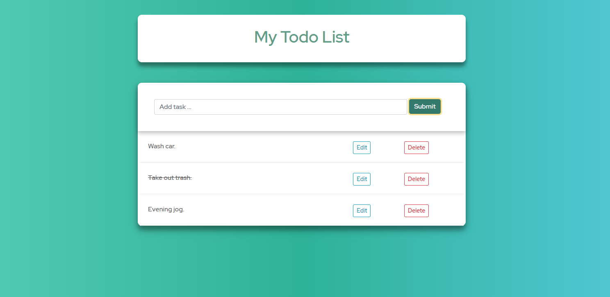

# Classic-Todo

A classic Todo application built with a Django backend and React frontend. A weekend project to brush up on my api design skills and making calls with Javascript. 

Allows for a user to create, edit, and delete todo items - a line of text.  

