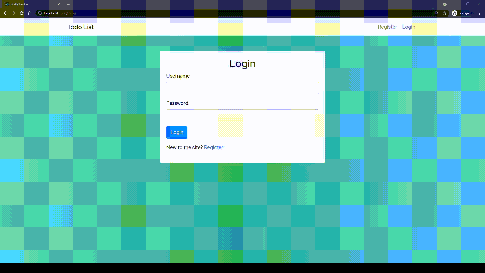

# Classic-Todo (Updated)

## Update: 

This was initially a quick project to review using the Django Rest Framework package to create an api and to intereact with it using React. As such only a single user could interact with the app - anytime a user accessed it, all previous todos (by other users) could be accessed. 
 
I wanted to push the project further by including multipe user functionality. This required user authentication and the handling of tokens to identify them. Doing so in react required me to address one of my grievances with React: state management. My previous projects with React were small enough that I could get by (still with headaches) using React's local state, but I ran into issues handling how I decided to handle state within this project (i.e. state related to the user, todo items, pop up messages, etc.)

And I finally dove into using Redux with React to manage my app's state. There were some bumps getting it all to work, but in hindsight (i.e. finally understanding the methodology behind Redux) I really enjoyed how Redux interacts with React - definitely going to use it again!

### Login and Use:

### Registration

A classic Todo application built with a Django backend and React frontend. A weekend project to brush up on my api design skills and making calls with Javascript. 

Allows for a user to create, edit, and delete todo items - a line of text.  

